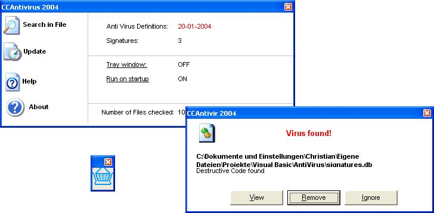



## Anti Virus 2004

### Description

This is a real working Anti Virus Program! This is how it works: It has a Signature file and searches for these signatures in every file you want to have scanned (10MB scanned within 7s).

But don't expect much when you scan your HD with this, because the Signaturefile only contains a few entries e.g. format, kill... That means the program is currently only able to detect a few script viruses, but this is done perfectly (Pleas mail me, when somebody knows a hughe Anti Virus DB, i can include to this).

I've included a online - updater for the signature file, command line commandos, a tray window for Drag and Drop and check out my LoadIcon and ShowOpenDlg Function!
 
### More Info
 

             |
---                |---
**Submitted On**   |2004-01-31 15:16:16
**By**             |[Cyber Chris](https://github.com/Planet-Source-Code/PSCIndex/blob/master/ByAuthor/cyber-chris.md)
**Level**          |Advanced
**User Rating**    |5.0 (20 globes from 4 users)
**Compatibility**  |VB 3\.0, VB 4\.0 \(16\-bit\), VB 4\.0 \(32\-bit\), VB 5\.0, VB 6\.0
**Category**       |[Complete Applications](https://github.com/Planet-Source-Code/PSCIndex/blob/master/ByCategory/complete-applications__1-27.md)
**World**          |[Visual Basic](https://github.com/Planet-Source-Code/PSCIndex/blob/master/ByWorld/visual-basic.md)
**Archive File**   |[Anti\_Virus170248212004\.zip](https://github.com/Planet-Source-Code/cyber-chris-anti-virus-2004__1-51401/archive/master.zip)

